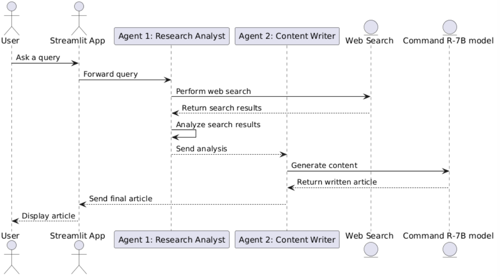
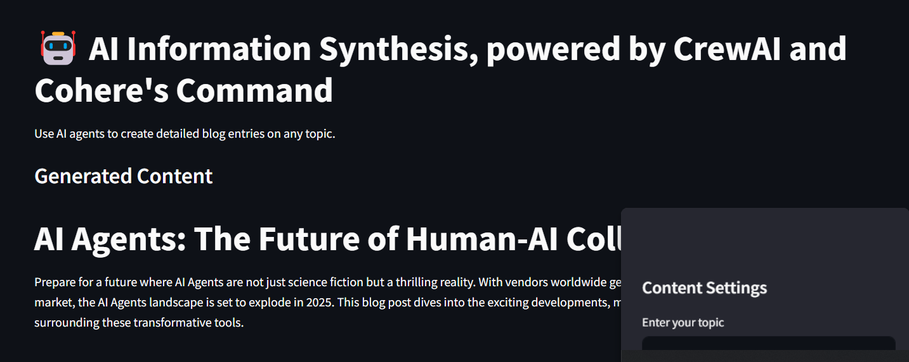
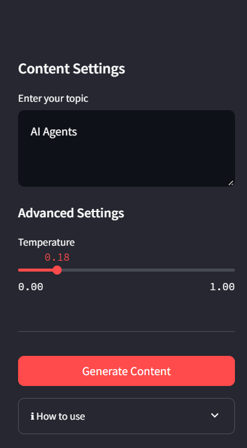

# 🌟 Multi-AI-Agent-Information-Synthesis

## 🥅 Objective
The application will take an individual's request, search the web for it, and generate a concise news piece with references.

## 🧠 Model and Details
- **Model**: Cohere’s latest ​Command R-7B
- **Details**: It’s a multilingual 7B-parameter open-weight model specialized in enterprise-focused LLM use cases.

## 🖼️ Main Design Image

## 🛠️ Tech Stack
- **CrewAI**: Used for multi-agent orchestration
- **Cohere's Command R-7B**: The LLM powering the system
- **APIs**: Serper and Cohere Platforms

## 🤖 Types of Agents and APIs Needed
### Agent 1: Research Analyst Agent
- Accepts the customer's investigation.
- Uses the Serper online search engine to retrieve results from the Internet.
- Consolidates the findings.

### Agent 2: Content Writer Agent
- Applies the refined results to create a polished, publishable article.

### APIs Used:
- **Serper API**
- **Cohere Platform API**

## 🧩 Components
1. **Streamlit App**: Acts as the user interface.
2. **Agent 1 (Research Analyst)**: Fetches and consolidates web search results.
3. **Agent 2 (Content Writer)**: Generates polished, publication-ready content.
4. **Orchestrator (CrewAI)**: Manages the workflow between components.

## 🔄 Working Flow
1. User inputs a query via the Streamlit App.
2. Query is passed to Agent 1 (Research Analyst), which performs a web search using Serper API and consolidates the results.
3. The consolidated data is forwarded to Agent 2 (Content Writer).
4. Agent 2 generates a concise and polished news piece using Cohere's Command R-7B model.
5. The final article is returned to the user through the Streamlit App.

## ✨ Output
- A concise, publication-ready news article with references.

## 📸 Additional Images

